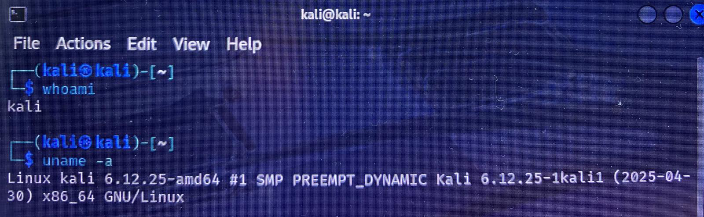
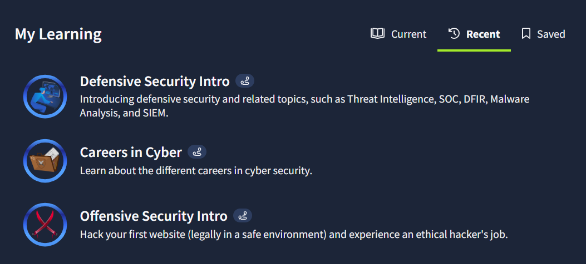

# Day 1 – Cybersecurity Journey

## What I Did
- Watched "Cybersecurity Beginner" video.
- Completed TryHackMe rooms: Offensive Security Intro, Defensive Security Intro, Careers in Cyber.
- Installed VirtualBox and set up Kali Linux VM.

## Key Concepts Learned
- Penetration testing phases: Recon → Scan → Exploit → Post-Exploit → Report
- SOC Analyst responsibilities
- Career paths: Red Team vs Blue Team

## Screenshots / Proof

